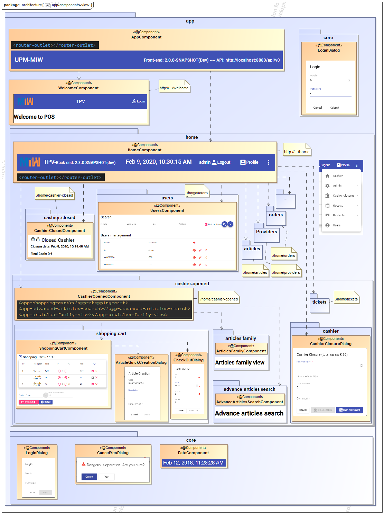
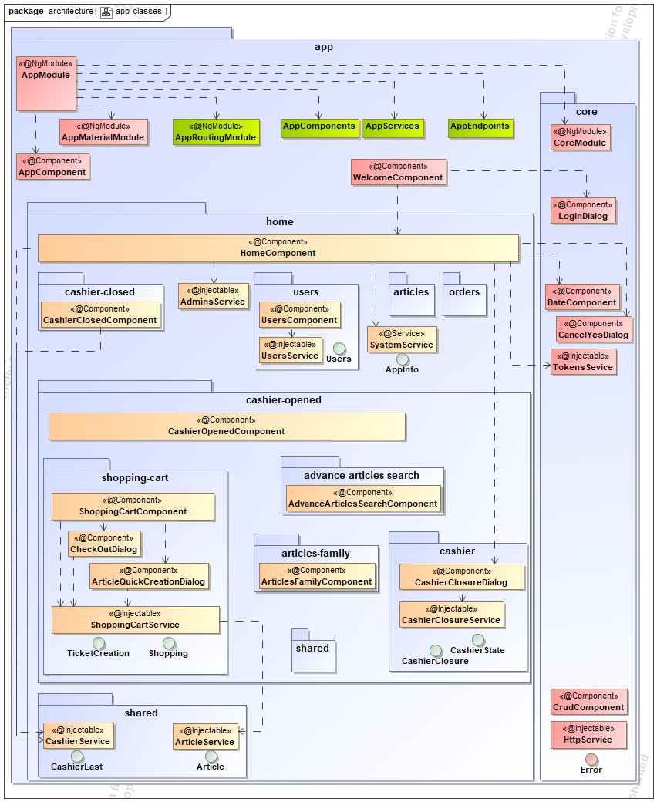
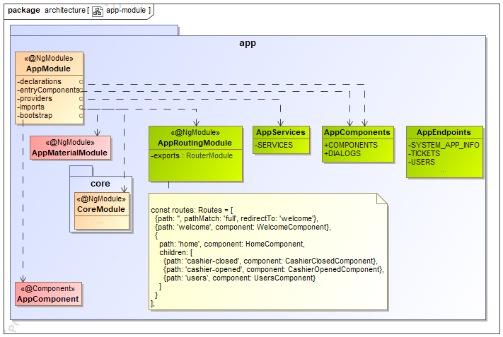

## [Máster en Ingeniería Web por la Universidad Politécnica de Madrid (miw-upm)](http://miw.etsisi.upm.es)
## Back-end con Tecnologías de Código Abierto: **SPRING**
> Proyecto TPV. Este proyecto es un apoyo docente de la asignatura. Es una aplicación Front-end,
mediante Angular, funcionando conjuntamente con 
Front-end: [betca-tpv-spring](https://github.com/miw-upm/betca-tpv-spring), 
realizado con Spring & webflux.

### Estado del código  
[](https://travis-ci.org/miw-upm/betca-tpv-angular)
[](https://betca-tpv-angular.herokuapp.com)   

### Tecnologías necesarias
`Typescript` `npm (6.13)` `Angular (8.3)` `Material` `Node (12.14)` `HTML` `CSS` --- CI: `GitHub` `Travis-CI` `Heroku`

### :gear: Instalación del proyecto
1. Clonar el repositorio en tu equipo, **mediante consola**:
```sh
> cd <folder path>
> git clone https://github.com/miw-upm/betca-tpv-angular
> cd betca-tpv-angular
betca-tpv-angular> npm install
```
2. Abrir el proyecto mediante **WebStorm**.
   * **Open**, y seleccionar la carpeta del proyecto.

3. Ejecución.
   * Ejecución en local atacando al back-end desplegado en Heroku, por consola: `> ng serve --prod`.
   * Ejecución en local atacando al back-end desplegado localmente: 
      1. Se debe tener arrancado el motor de MongoDB: `mongodb://localhost:27017/tpv`  
      1. Se debe arrancar el **Back-end**: `> mvn clean spring-boot:run`    
      1. Se debe arrancar **Angular**: `> ng serve`   

###  :movie_camera: Videos explicativos
[Interfaz de Usuario](https://youtu.be/yBZ3SHShimE)   
[Front-End. Angular](https://youtu.be/2ZAd1uIx_E8)

## :book: Documentación del proyecto
> Este proyecto es la práctica de Angular desarrollada de forma colaborativa por todos los alumnos. Se parte de la versión `core`,
ya implementada, y se pretende ampliar con un conjunto de mejoras. Un **T**erminal **P**unto de **V**enta
es un sistema informático que gestiona el proceso de venta mediante una interfaz accesible para los vendedores o compradores.
Permite la creación e impresión del recibo ticket o factura de venta —con los detalles de las referencias y precios— de los artículos vendidos,
actualiza los cambios en el nivel de existencias de mercancías (STOCK) en la base de datos...

### Interfaz de Usuario
* [App TPV desplegada en Heroku](https://betca-tpv-angular.herokuapp.com)

### Arquitectura

#### Aplicación Web 


#### Angular


#### TPV: Vista de componentes


#### TPV: Diagrama de clases


#### Plantilla de la arquitectura 


### Diseño y reparto de responsabilidades

#### Módulo principal


#### Módulo Core


#### Responsabilidades

###### Vista (HTML)
> Organiza la vista.  
> No procesa cuestiones de vista, las delega en el componente.
Como exceptión se permite un proceso muy simple, por ejemplo deshabilitar un botón por no tener valor de entrada.  

:heavy_check_mark:
```xml
<mat-dialog-actions>
  <button mat-button mat-dialog-close tabindex="-1">Cancel</button>
  <button mat-button (click)="create()" [disabled]="invalidArticle()">Create</button>
</mat-dialog-actions>
```
```xml
<button mat-button *ngIf="mobile" matSuffix mat-icon-button aria-label="Clear" (click)="mobile=undefined">
  <mat-icon>close</mat-icon>
</button>
```
:x:
```xml
<mat-dialog-actions>
  <button mat-button mat-dialog-close tabindex="-1">Cancel</button>
  <button mat-button (click)="create()" [disabled]="!this.article.description || !this.article.retailPrice">Create</button>
</mat-dialog-actions>
```

##### Componente
> Obtener los datos a traves del `Servicio Local`.   
> Procesar exclusivamente para preparar la vista.   
> NO realiza procesos de negocio NI realiza peticiones al API, lo delega en el servicio Local.  

:heavy_check_mark:
```typescript
import {Component} from '@angular/core';
import {MatDialog, MatDialogRef} from '@angular/material';

import {CashierClosureService} from cashier;
import {CashierState} from cashier-closure;
import {CashierClosure} from cashier;

@Component({
  templateUrl: cashier,
  styleUrls: [cashier]
})
export class CashierClosureDialogComponent {
  cashierClosureFinal: CashierClosure = {finalCash: undefined, finalCard: undefined, comment: undefined};
  cashierState: CashierState =
    {salesTotal: undefined, totalCard: undefined, totalCash: undefined, totalVoucher: undefined};

  constructor(private dialog: MatDialog, private dialogRef: MatDialogRef<CashierClosureDialogComponent>,
              private cashierClosureService: CashierClosureService) {
    this.cashierClosureService.readLastTotals().subscribe(
      cashierClosureData => this.cashierState = cashierClosureData
    );
  }

  close() {
    this.cashierClosureService.close(this.cashierClosureFinal).subscribe(
      () => this.dialogRef.close()
    );
  }

  invalid() {
    return (!this.cashierClosureFinal.finalCash && this.cashierClosureFinal.finalCash !== 0)
      || (!this.cashierClosureFinal.finalCard && this.cashierClosureFinal.finalCard !== 0)
      || !this.cashierClosureFinal.comment;
  }

  cashMovement() {
    this.cashierClosureService.move().subscribe();
  }
}
```

##### Servicio
> Realiza las peticiones del API a traves del `servicio Http` de Core.  
> Si hay peticiones repetidas entre varios servicios, se delega a un servicio más genérico situado en una carpeta `shared`.  

:bulb:
```typescript
this.tokensService.login(this.mobile, this.password).subscribe(...
this.tokensService.isAdmin()...
this.tokensService.isManager()...
```
```typescript
  demo1(): Observable<any> {
    return this.httpService.successful().pdf().param('param', 'value').get('...');
  } 
  
  demo2(): Observable<any> {
    return this.httpService.post('...', object);
  }
```

#### Mocks
[RxJS-Reactive Extensions Library for JavaScript](https://rxjs.dev/guide/overview).
```typescript
import {EMPTY, from, Observable, of, range, throwError, timer} from 'rxjs';
import {delay, take} from 'rxjs/operators';

rxjs1(): Observable<string> {
  return of('a').pipe(delay(1000));
}
rxjs2(): Observable<any> {
  return of({uno: 'uno', dos: 'dos'});
}
rxjs3(): Observable<void> {
  return EMPTY;
}
rxjs4(): Observable<any> {
   return throwError(new Error('oops!'));
}
rxjs5(): Observable<any> {
  return timer(0, 500).pipe(take(5));
}
rxjs6(): Observable<any> {
  return range(0, 5).pipe(take(5));
}
rxjs7(): Observable<any> {
  const array = [
    {uno: 'uno', dos: 'dos'},
    {uno: '1', dos: '2'},
    {uno: 'a', dos: 'b'},
  ];
  return from(array);
}
```

:heavy_check_mark:
```typescript
import {Injectable} from '@angular/core';
import {Observable} from 'rxjs';

import {HttpService} from '../../../core/http.service';
import {ApiEndpoint} from '../../shared/api-endpoint.model';
import {CashierState} from cashier-closure;
import {CashierClosure} from cashier;

@Injectable()
export class CashierClosureService {
  static STATE = '/state';

  constructor(private httpService: HttpService) {
  }

  close(cashierClosure: CashierClosure): Observable<any> {
    return this.httpService.patch(ApiEndpoint.CASHIER_CLOSURES_LAST, cashierClosure);
  }

  readLastTotals(): Observable<CashierState> {
    return this.httpService.get(
      ApiEndpoint.CASHIER_CLOSURES_LAST + CashierClosureService.STATE);
  }
}
```

:grey_question:
```typescript
export interface ArticleQuickCreation {
  code: string;
  description: string;
  retailPrice: number;
}
```
:heavy_check_mark:
```typescript
export interface Article {
  code: string;
  reference?: string;
  description: string;
  retailPrice: number;
  stock?: number;
  provider?: string;
  discontinued?: boolean;
  registrationDate?: Date;
}
```

```typescript
create(article: Article): Observable<Article> {
    return this.httpService.successful().post(AppEndpoints.ARTICLES, article);
}

this.ref.create(articleQuickCreation);
```

#### Autenticación
Se plantean mediante **Basic Auth** para logearse y obtener un **API Key** o **token** de tipo **JSON Web Tokens (JWT)** y **Bearer auth** para el acceso a los recursos.  
Para obtener el **API Key** se accede al recurso: `POST \users\token`, enviando por **Basic auth** las credenciales, van en la cabecera de la petición.   
Para el acceso a los recursos, se envia el **token** mediante **Bearer auth**, también en la cabecera de la petición
> Authorization = Basic \<user>:\<pass><sub>Base64</sub>  
> Authorization = Bearer \<header><sub>Base64</sub> .\<payload><sub>Base64</sub> .\<signature><sub>Base64</sub>

```typescript
export interface Token {
  token: string;
  mobile?: number;
  name?: string;
  roles?: Array<Role>;
}
```
```typescript
import {JwtHelperService} from '@auth0/angular-jwt';
...
@Injectable()
export class HttpService {
  private token: Token;
  ...
  private authBasic(mobile: number, password: string): HttpService {
    return this.header('Authorization', 'Basic ' + btoa(mobile + ':' + password));
  }
  login(mobile: number, password: string, endPoint: string): Observable<any> {
    return this.authBasic(mobile, password).post(endPoint).pipe(
      map(token => {
        this.token = token;
        this.token.mobile = new JwtHelperService().decodeToken(token.token).user;
        this.token.name = new JwtHelperService().decodeToken(token.token).name;
        this.token.roles = new JwtHelperService().decodeToken(token.token).roles;
      }), catchError(error => {
        return this.handleError(error);
      })
    );
  }
  post(endpoint: string, body?: Object): Observable<any> {
    return this.http.post(HttpService.API_END_POINT + endpoint, body, this.createOptions()).pipe(
      map(response => this.extractData(response)
      ), catchError(error => {
        return this.handleError(error);
      })
    );
  }  
  ...
  private createOptions(): any {
    if (this.token !== undefined) {
      this.header('Authorization', 'Bearer ' + this.token.token);
    }
  ...
  }
  ...
}
```

### Organización del código

#### Métricas
* Paquete: <20 clases.
* Clases: <500-200 líneas, <20 métodos.
* Métodos: <3-5 parámetros, <20 líneas.

#### Diálogos
Genéricos, el _**dialog**_ devuelve los datos y se gestiona su evolución en la llamada
```typescript
deleteDb() {
  this.dialog.open(CancelYesDialogComponent).afterClosed().subscribe(
    result => {
      if (result) {
        this.adminsService.deleteDb();
      }
    });
}
```
```html
<mat-dialog-actions>
  <button mat-raised-button mat-dialog-close cdkFocusInitial color="primary">Cancel</button>
  <button mat-raised-button [mat-dialog-close]="true">Yes</button>
</mat-dialog-actions>
```
```typescript
@Component({
  templateUrl: 'cancel-yes-dialog.component.html',
  styleUrls: ['./dialog.component.css']
})
export class CancelYesDialogComponent {
}
```
Específicos, el _**dialogo**_ se encarga de llamar al servicio
```typescript
  login() {
    this.dialog.open(LoginDialogComponent,
      {
        data: {homeUrl: HomeComponent.URL}
      }
    );
  }
```
```html
<h3 mat-dialog-title>Login</h3>
<mat-dialog-content>
  <mat-form-field>
    <input matInput type="text" placeholder="Mobile" [(ngModel)]="mobile"/>
    <button mat-button *ngIf="mobile" matSuffix mat-icon-button aria-label="Clear" (click)="mobile=undefined"
            cdkFocusInitial>
      <mat-icon>close</mat-icon>
    </button>
  </mat-form-field>
  <mat-form-field>
    <input matInput type="password" placeholder="Password" [(ngModel)]="password"/>
  </mat-form-field>
</mat-dialog-content>
<mat-dialog-actions>
  <button mat-button mat-dialog-close>Cancel</button>
  <button mat-button mat-dialog-close (click)="login()">Submit</button>
</mat-dialog-actions>
```
```typescript
export class LoginDialogComponent {
  mobile: number;
  password: string;
  homeUrl: string;

  constructor(@Inject(MAT_DIALOG_DATA) data: any, private tokensService: TokensService, private router: Router) {
    this.homeUrl = data.homeUrl;
  }

  login() {
    this.tokensService.login(this.mobile, this.password).subscribe(
      () => this.router.navigate([this.homeUrl])
    );
  }
}
```

#### Observadores
Con un ciclo de vida sin cierre. El sujeto observado, pueden cambiar por acciones en otro lugar de la aplicación a lo largo del tiempo. Debemos darnos de baja cuando se destruya el componente.
```typescript
this.subscription = this.cashierService.lastObservable().subscribe(
  data => {
    this.cashierClosed = data.closed;
    if (data.closed) {
      this.router.navigate([HomeComponent.URL, CashierClosedComponent.URL]);
    } else {
      this.router.navigate([HomeComponent.URL, CashierOpenedComponent.URL]);
    }
  }
);
```
```typescript
ngOnDestroy(): void {
  this.subscription.unsubscribe();
}
```
Peticiones asíncronas al API, se cierran automáticamente al finalizar la petición
```typescript
seedDb(file: File): void {
  const formData: FormData = new FormData();
  formData.append('file', file, file.name);
  this.httpService.successful().post(AdminsService.END_POINT + AdminsService.DB, formData).subscribe(() => {
  });
}
```
Proceso intermedio de los datos
```typescript
  login(mobile: number, password: string, endPoint: string): Observable<any> {
    return this.authBasic(mobile, password).post(endPoint).pipe(
      map(token => {
        this.token = token;
        this.token.mobile = new JwtHelperService().decodeToken(token.token).user;
        this.token.name = new JwtHelperService().decodeToken(token.token).name;
        this.token.roles = new JwtHelperService().decodeToken(token.token).roles;
      }), catchError(error => {
        return this.handleError(error);
      })
    );
  }
```

#### CrudComponent

```html
<!-- Default: [createAction]="true" [readAction]="true" [updateAction]="true" [deleteAction]="true"-->

<app-crud [data]="data" [title]="title" [columns]="columns";
          (create)="create()" (read)="read($event)" (update)="update($event)" (delete)=delete($event)></app-crud>
          
<app-crud [data]="data" [title]="title" [columns]="columns" [readAction]="false" [deleteAction]="false";
          (create)="create()" (update)="update($event)" </app-crud>          
```

```typescript
export class UsersComponent {
  ...

  title = 'Users management';
  columns = ['mobile', 'username'];
  data: User[];
  
  ...
  
  create() {
    // TODO
  }
  read(user: User) {
    // TODO
  }
  update(user: User) {
    // TODO
  }
  delete(user: User) {
    // TODO
  }
}
```

## Anexo I. Despliegue de Angular en Heroku
### Travis-CI
Integración continua con **Travis-CI**. Se despliega para ejecución de los test Unitarios y de Integración.
* En el fichero `.travis.yml`:
```yaml
language: node_js
node_js:
  - '12'
addons:
  chrome: stable
branches:
  - develop
  - /^release-[0-999].[0-999]$/
  - master
notifications:
  email:
    recipients:
      - j.bernal@upm.es
script:
  - ng test --watch=false --no-progress --browsers=ChromeHeadlessNoSandbox
  - ng e2e --protractor-config=e2e/protractor-travis.conf.js

# Deploy https://betca-tpv-angular.herokuapp.com
deploy:
  provider: heroku
  api_key:
    secure: $HEROKU
  on:
    branch: master
```
* Se ha creado el fichero `e2e/protractor-travis.conf.js` con el contenido:
```js
const config = require('./protractor.conf').config;
config.capabilities = {
  browserName: 'chrome',
  chromeOptions: {
    args: ['--headless', '--no-sandbox']
  }
};
exports.config = config;
```

### Entorno-Perfil
`environment.ts`
```typescript
export const environment = {
  production: false,
  VERSION: require('../../package.json').version,
  API: 'http://localhost:8080/api/v0'
};
```
`environment.prod.ts`
```typescript
export const environment = {
  production: true,
  VERSION: require('../../package.json').version,
  API: 'https://betca-tpv-spring.herokuapp.com/api/v0'
};
```

### Heroku
Se realiza un despliegue en **Heroku** .  
En la cuenta de **Heroku**, en la página `-> Account settings -> API Key`, se ha obtenido la `API KEY`.  
En la cuenta de **Travis-CI**, dentro del proyecto, en `-> More options -> Settings`, se ha creado una variable de entorno llamada `HEROKU` cuyo contenido es la **API key** de **Heroku**.  

* En el fichero `package.json`:
```json
{
  "scripts": {
    "postinstall": "ng build --prod",
    "start": "node server.js"
  },
  "engines": {
    "node": "~12.14.1",
    "npm": "~6.13.4"
  }  
}
```
* Se ha añadido al fichero `.travis.yml` el contenido:
```yaml
# Deploy https://betca-tpv-angular.herokuapp.com
deploy:
  provider: heroku
  api_key:
    secure: $HEROKU
  on:
    branch: master
```

## Anexo II. Versionado

### **package.json**
```json
{
  "name": "betca-tpv-angular",
  "version": "2.1.0-SNAPSHOT",
  "scripts": {
    "postinstall": "ng build --prod",
    "start": "node server.js"
  },
  "engines": {
    "node": "~12.14.1",
    "npm": "~6.13.4"
  },
  "private": true,
  "dependencies": {
    "@angular/animations": "~8.2.14",
    "@angular/cdk": "~8.2.3",
    "@angular/common": "~8.2.14",
    "@angular/compiler": "~8.2.14",
    "@angular/core": "~8.2.14",
    "@angular/flex-layout": "^9.0.0-beta.28",
    "@angular/forms": "~8.2.14",
    "@angular/material": "^8.2.3",
    "@angular/platform-browser": "~8.2.14",
    "@angular/platform-browser-dynamic": "~8.2.14",
    "@angular/router": "~8.2.14",
    "@auth0/angular-jwt": "^3.0.1",
    "express": "^4.17.1",
    "hammerjs": "^2.0.8",
    "rxjs": "~6.4.0",
    "tslib": "^1.10.0",
    "zone.js": "~0.9.1"
  },
  "devDependencies": {
    "@angular-devkit/build-angular": "~0.803.24",
    "@angular/cli": "~8.3.24",
    "@angular/compiler-cli": "~8.2.14",
    "@angular/language-service": "~8.2.14",
    "@types/node": "~8.9.4",
    "@types/jasmine": "~3.3.8",
    "@types/jasminewd2": "~2.0.3",
    "codelyzer": "^5.0.0",
    "jasmine-core": "~3.4.0",
    "jasmine-spec-reporter": "~4.2.1",
    "karma": "~4.1.0",
    "karma-chrome-launcher": "~2.2.0",
    "karma-coverage-istanbul-reporter": "~2.0.1",
    "karma-jasmine": "~2.0.1",
    "karma-jasmine-html-reporter": "^1.4.0",
    "protractor": "~5.4.0",
    "ts-node": "~7.0.0",
    "tslint": "~5.15.0",
    "typescript": "~3.5.3"
  }
}
```
  `~: versión mas cercana posible, ^: versión compatible mas alta`
